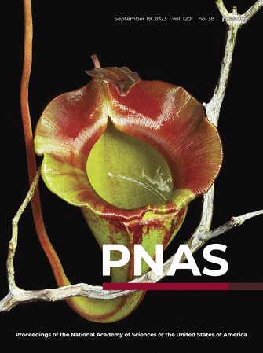

::: {.intro}

## About us

Our interdisciplinary team crosses the physical-life science divide. We explore how living organisms – especially plants – adapt and evolve, using mathematical modelling, to address long-standing evolutionary questions. By combining biology with modelling and mechanics, we seek to uncover the principles underlying plant form and function and translate these insights into innovative technologies inspired by nature.

We answer questions such as:

- How does the squirting cucumber squirt? 
- Why are the world’s largest flowers gigantic?
- How does geometry influence prey capture in carnivorous plants? 
- How do giant waterlilies organise themselves on the water’s surface?
- Can adaptations to life in extreme environments inspire novel technologies?

## News

::: {.news-carousel}

[‹]{#news-prev .news-button}

::: {.news-window}
::: {.news-track}

::: {.news-item .active}
**July 2026** · Creation of the *Plant Modelling Group*.
:::

::: {.news-item .active}
**June 2026** · New paper in *Quantitative Plant Biology*: [*Towards a hydromechanical theory of plant active matter*](https://www.cambridge.org/core/journals/quantitative-plant-biology/article/towards-a-hydromechanical-theory-of-plant-active-matter/50D8AB246D02C0B6FAAE3D81FF9762EA).
:::

::: {.news-item .active}

:::: {.columns}
::: {.column width="30%"}
::: {.center}
[{width="50%"}](https://www.pnas.org/toc/pnas/120/38)
:::
:::

::: {.column width="70%"}
**September 2023** · Carnivorous pitcher plants on the cover of PNAS.
:::

::::

:::

:::
:::

[›]{#news-next .news-button}

:::

