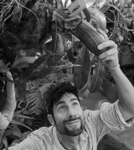
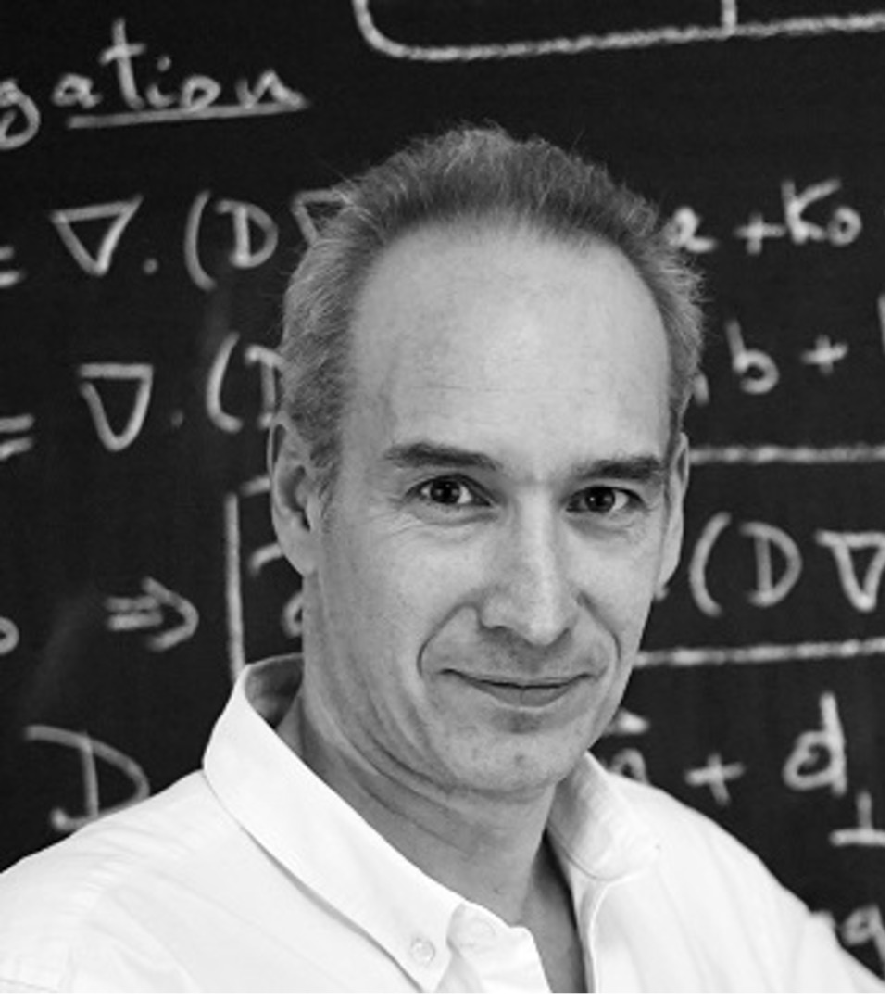
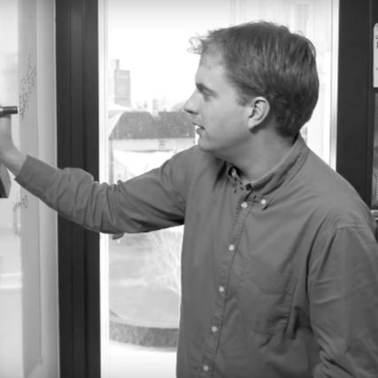
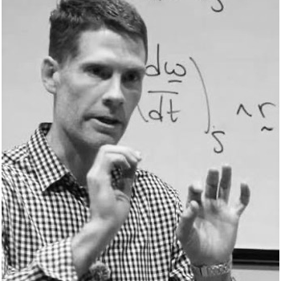
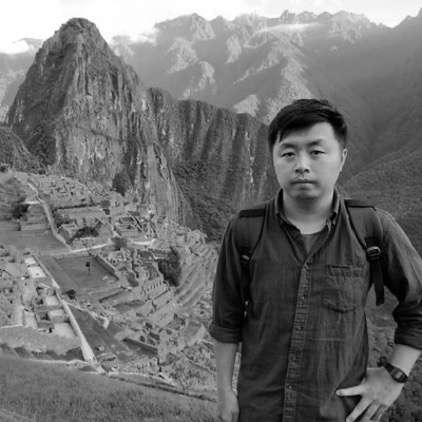
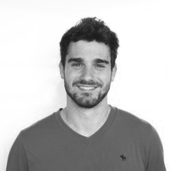

**Chris Thorogood** is an Associate Professor of biology at the University of Oxford where he is Deputy Director and Head of Science at the Botanic Garden and Arboretum. Chris explores how adaptations drive evolution in non-model plants. He is passionate about biomimetics – combining disciplines to identify applications in technology. He is the Scientific Advisor at Oxford’s Technology and Industrialisation for Development Centre (TIDE).

::: {.spacer}
:::

**Alain Goriely** FRS holds the statutory Professorship of Mathematical Modelling at the University of Oxford’s Mathematical Institute. He is Director of the Oxford Centre for Industrial Mathematics of the International Brain and Mechanics Lab (IBMTL). Alain is interested in a broad range of problems including the mechanics of biological growth, modelling of the brain, and more generally, the development of mathematical methods for applied sciences.

::: {.spacer}
:::

**Dominic Vella** is a Professor of Applied Mathematics at the University of Oxford’s Mathematical Institute. Dominic’s research is concerned with various aspects of solid and fluid mechanics, with particular focus on elastic snap-through, the wrinkling of thin elastic objects and surface tension of liquids. 

::: {.spacer}
:::

**Derek Moulton** is a Professor of Applied Mathematics based in the Wolfson Centre for Mathematical Biology in the Mathematical Institute at the University of Oxford. Derek’s interests centre on mathematical modelling of biological phenomena from a mechanical perspective, in particular, growth and pattern formation, physiology, and elastic mechanisms in nature.

::: {.spacer}
:::

**Hadrien Oliveri** is an applied mathematician and Group Leader at the Max Planck Institute for Plant Breeding Research, Cologne. His research develops physics-based theories of biological form and motion, with plants as a central model system. Hadrien combines mechanics, growth, and water transport to study plant morphogenesis, movement, tropisms, physiology, ecology, and behaviour.

::: {.spacer}
:::

**James (Jian Hui) Guan** is a Lecturer in Mathematics at the University of Hull. He works in fluid mechanics, plant physics, and applied mathematics, studying droplets, bubbles, and capillary-scale Faraday waves. He also studies the mechanics of plants and other living organisms and is interested in biomimetics: using natural structures to inform new engineering solutions.

::: {.spacer}
:::

**Andrea Giudici** is an applied mathematician whose work focuses on solid mechanics. His research spans elastic instabilities and spontaneous shape changes in slender structures, as well as deformations in lithium-ion batteries and their effects on cell performance. He is a Leverhulme Fellow at the University of Oxford Botanic Garden and Arboretum, where he studies how mechanical and geometric effects shape the growth and organisation of giant Amazonian waterlilies.