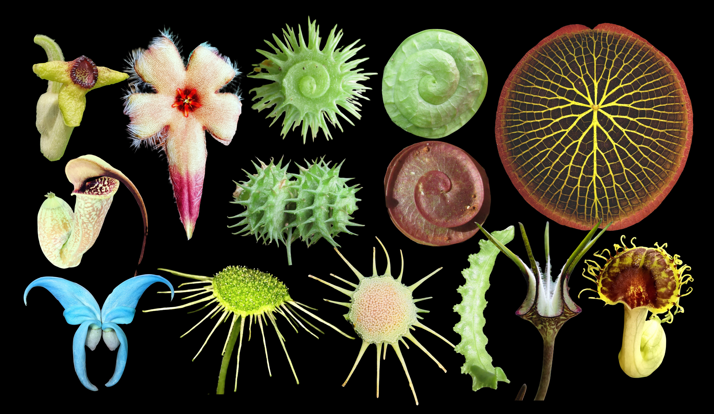
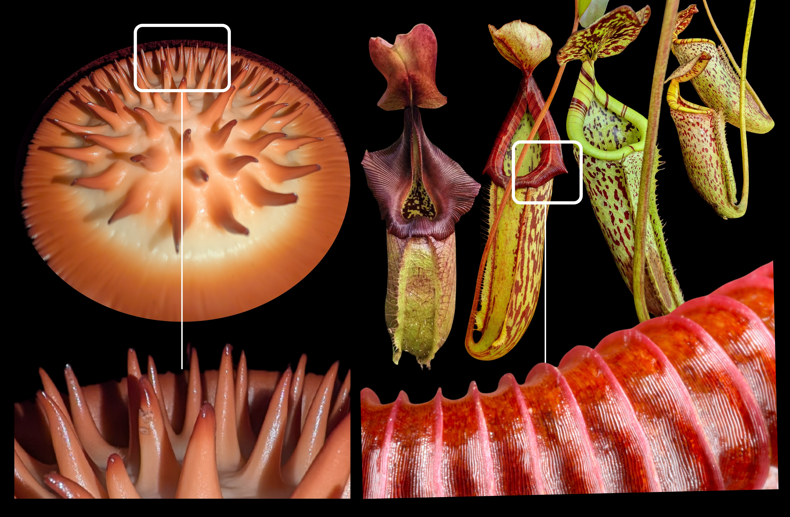

### A MODELLING-BASED APPROACH

***The Plant Kingdom offers a living library for scientists to explore.*** 

Our research explores how living organisms – especially plants – adapt and evolve in the face of environmental pressures. We use mathematical modelling to answer questions about form and function. For example, why does the squirting cucumber squirt? This botanical enigma was known to the ancient Greeks. Yet how the fruit sends its seeds 2000 times their own length into the air in a jet of slime remained a mystery until we used high-speed imaging, mechanical analysis, and mathematical modelling to reveal the mechanism. Another question we have tackled is: how might trap geometry influence prey capture in carnivorous pitcher plants? Rather than relying solely on observational biology, we combined biomechanics, mathematics, and evolutionary biology to show that specific geometric features optimise the movement of insects towards the trap’s interior, while balancing the energetic costs of producing larger structures.

Questions such as these can be challenging to address in complex natural systems. For example, many pitcher plants grow in remote or inaccessible mountain habitats where observational biology concerning prey spectra is difficult; here, gathering meaningful, highly replicated datasets is near-impossible. Mathematical modelling allows us to test hypotheses and guide future research in a tractable way. 

{width="760px"}

### BIOMIMETICS

***Plants are highly adaptive and they hold the answers to major global challenges.*** 

Biomimetics (here defined to encompass biomimicry in the broadest sense) is concerned with how adaptations which evolved over millions of years through evolution by natural selection, can inform technology. This could take the form of a natural structure, a function or a process. For example the squirting cucumber's pressure-driven mechanism could inspire the development of passive fluid-dispensing systems, soft robotic actuators, drug-delivery devices, or microfluidic technologies that require rapid and controlled release without complex mechanical components. The ability to generate powerful, self-contained actuation through stored elastic energy offers engineers a model for designing lightweight, energy-efficient systems that operate without continuous external power. 

Meanwhile in nature, the carnivorous pitcher plant’s slippery surface controls the motion of insects through passive mechanical interactions without requiring moving parts or external energy input. This principle has already inspired the development of liquid-infused and anisotropic surfaces in technology that direct droplet or object movement using only surface geometry and wettability. Such technologies have potential applications in self-cleaning materials, microfluidic devices, water harvesting systems, anti-fouling coatings, and low-energy transport of liquids.

A current focus of the Plant Modelling Group is giant waterlily-inspired floating solar panel technology. Our former work shows that giant waterlily leaves’ hierarchical network of radial and transverse struts distributes loads efficiently across the leaf surface, allowing the plant to produce a large photosynthetic surface that floats on water without collapsing, while reducing the energetic cost of growth. This enhances our understanding of structural optimisation in plants and demonstrates how biological systems can achieve high performance through intelligent material distribution without increased material use. This, in turn, provides the design principles for lightweight engineering structures – including the future development of floating offshore photovoltaics. 

{width="760px"}

### OUR PARTNERS

We work with a global community of scientists to explore plants – some of which have never been examined – to understand how they adapt and evolve, and what we can learn from them to address global challenges. For example, in Southeast Asia, we work with the Community for the Conservation and Research of Rafflesia ([CCRR](https://ccrr.obga.ox.ac.uk/home)) to apply mathematical modelling to the pollination of the world’s largest flowers, many of which are rare and inaccessible, so impossible to study in vivo. In Oxford, we work closely with the TIDE Centre – [Technology and Industrialisation for Development](https://oxford-tide.org), exploring the intersections between technology, industrialisation, innovation and biodiversity, and finding ways to apply biomimetics to solving global challenges. 
 

[See our selected publications](publications.html)
